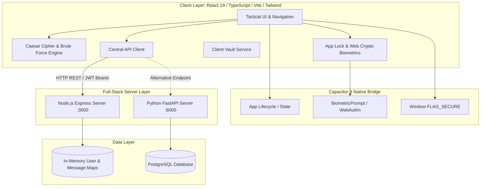

# Secure Military Communication Using Caesar Cipher
### An Academic Cryptography Demonstration Platform & Defense-in-Depth Software Architecture

[](LICENSE)
[](package.json)
[](package.json)
[](package.json)
[](server.ts)
[](backend/requirements.txt)
[](capacitor.config.ts)

---

## ⚠️ Mandatory Academic & Cryptographic Notice

> **IMPORTANT DISCLAIMER:**  
> This project is developed strictly for **academic research, educational demonstrations, and software engineering coursework**.  
> The **Caesar Cipher** implemented in this platform is a classical monoalphabetic substitution cipher with an effective keyspace of only 25 non-trivial shifts ($k \in [1, 25]$) and $\approx 4.70$ bits of entropy. It is vulnerable to instantaneous brute-force exhaustion and frequency analysis.  
> **This software must NOT be utilized for actual military, governmental, banking, medical, or confidential communications.** The military tactical theme serves as an intuitive pedagogical metaphor to illustrate communication security, telemetry, and defense-in-depth principles.

---

## 📖 Complete Documentation Index

A comprehensive suite of academic and technical documentation is maintained in the [`/docs`](docs/) directory:

| Document | Description | Target Audience |
| :--- | :--- | :--- |
| 📄 [**Project Report**](docs/PROJECT_REPORT.md) | Complete academic project report with problem statement, objectives, mathematical foundations, and findings. | Academic Evaluators, Faculty |
| 🏛️ [**System Architecture**](docs/SYSTEM_ARCHITECTURE.md) | In-depth architecture diagrams, component trees, context providers, and data flows. | Software Engineers, Architects |
| ✨ [**Feature Inventory**](docs/FEATURES.md) | Exhaustive specifications of the cipher engine, brute-force solver, auth, and App Lock. | Product Reviewers, Developers |
| 🔌 [**API Documentation**](docs/API_DOCUMENTATION.md) | REST API endpoints, request/response JSON schemas, JWT authentication, and status codes. | API Integrators, QA Engineers |
| 🗄️ [**Database & Storage Design**](docs/DATABASE_DESIGN.md) | ER diagrams, PostgreSQL DDL schemas, in-memory structures, and client-side storage keys. | Database Administrators |
| 🛡️ [**Security Architecture**](docs/SECURITY_DESIGN.md) | Threat model (STRIDE), PBKDF2 hashing, constant-time verification, App Lock, and `FLAG_SECURE`. | Security Analysts, Auditors |
| 🎨 [**UI/UX Design System**](docs/UI_UX_DOCUMENTATION.md) | Tactical military theme, color palette, typography hierarchy, and FOUC prevention mechanism. | UI/UX Designers |
| 🧪 [**Testing & QA Guide**](docs/TESTING.md) | Test phase matrix, unit vs integration test scenarios, and execution commands. | QA Engineers, Testers |
| 🚀 [**Deployment Operations**](docs/DEPLOYMENT.md) | Full-stack Node.js, FastAPI, Docker, and Android Capacitor APK build instructions. | DevOps, Deployment Teams |
| 🔧 [**Troubleshooting Guide**](docs/TROUBLESHOOTING.md) | Resolution steps for port conflicts, PIN reset, authentication errors, and build failures. | Support & Developers |
| 🎓 [**Viva Voce Preparation**](docs/VIVA_NOTES.md) | 30+ categorized technical defense questions and answers for viva exams and presentations. | Students Defending Project |

---

## 🏛️ System Architecture



---

## 🚀 Key Features

- **Pure Client-Side Caesar Cipher Engine:** Real-time encryption, decryption, and ROT13 transformation with casing preservation, symbol invariance, and interactive rotary dials.
- **Automated Brute-Force Cryptanalysis Solver:** Exhaustive 25-permutation key search with English letter frequency correlation scoring and dictionary token matching.
- **Operator Authentication & Clearances:** HMAC-SHA256 JWT access tokens, PBKDF2 password hashing (100,000 rounds), rate-limiting login protection, Google OAuth 2.0 gateway, and role-based clearance levels (`CONFIDENTIAL`, `SECRET`, `TOP_SECRET`).
- **Client-Side App Lock & Local Defense:** 6-digit PIN protected by client-side Web Crypto PBKDF2-SHA256 derivation, constant-time verification, hardware biometric unlock, inactivity auto-lock, Android `FLAG_SECURE` screen privacy, and auto-clearing clipboard timers.
- **Zero-Plaintext Encrypted Message Vault:** User-isolated message history where plaintexts are strictly processed in volatile client memory and never transmitted or stored on backend servers.
- **Native Android APK Container:** Packaged via Capacitor 8 with hardware back button routing, native clipboard management, and status bar theming.
- **Tactical Responsive UI:** Light, Dark, and System modes with inline FOUC prevention script, high-contrast monospace displays, and responsive desktop/mobile layouts.

---

## ⚡ Quick Start

### Prerequisites
- **Node.js:** v18.0.0 or higher (v20+ recommended)
- **npm:** v9.0.0 or higher
- **Python:** v3.10+ (optional, for FastAPI backend)
- **Android Studio:** API Level 34/36 (optional, for Android APK builds)

### 1. Installation
```bash
git clone https://github.com/your-username/secure-military-communication.git
cd secure-military-communication
npm install
```

### 2. Configure Environment
```bash
cp .env.example .env
```

### 3. Launch Development Server
```bash
npm run dev
```
Open [http://localhost:3000](http://localhost:3000) in your browser.

---

## 🧪 Testing

Execute the automated test suites:
```bash
# Run unit & mathematical test suites
npm test

# Run TypeScript type checks
npm run lint
```

---

## 📱 Android Native Build (Capacitor 8)

```bash
# Build web bundle and sync native Android assets
npm run cap:build

# Open project in Android Studio
npm run cap:open

# Or build debug APK directly via Gradle
cd android && ./gradlew assembleDebug
```

---

## 📜 License & Academic Usage

This project is open-source and licensed under the [MIT License](LICENSE).  
Academic institutions, researchers, and students are encouraged to utilize this repository for educational demonstrations, software engineering case studies, and cryptology coursework.
