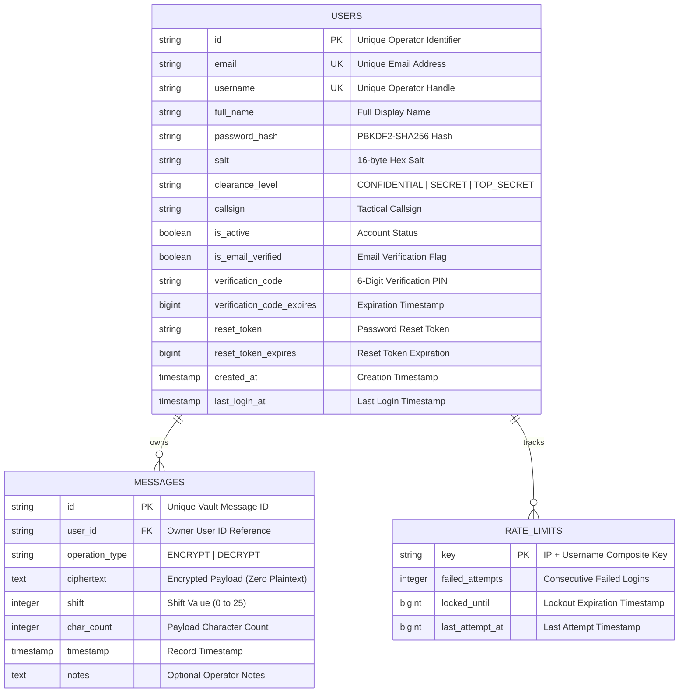

# Database & Storage Design Specification
# Secure Military Communication Platform

---

## 1. Overview & Storage Strategy

The **Secure Military Communication** platform employs a hybrid, multi-tier data storage strategy designed to balance high-speed client-side execution, offline resilience, and secure multi-user server synchronization.



---

## 2. Server-Side Relational Schema (PostgreSQL DDL)

For production deployment with PostgreSQL, the following DDL statements define the normalized database tables:

```sql
-- 1. Users Table
CREATE TABLE users (
    id VARCHAR(64) PRIMARY KEY,
    email VARCHAR(255) UNIQUE NOT NULL,
    username VARCHAR(100) UNIQUE NOT NULL,
    full_name VARCHAR(255) NOT NULL,
    password_hash VARCHAR(255) NOT NULL,
    salt VARCHAR(64) NOT NULL,
    clearance_level VARCHAR(32) DEFAULT 'SECRET' NOT NULL,
    callsign VARCHAR(64),
    is_active BOOLEAN DEFAULT TRUE NOT NULL,
    is_email_verified BOOLEAN DEFAULT FALSE NOT NULL,
    verification_code VARCHAR(32),
    verification_code_expires BIGINT,
    reset_token VARCHAR(64),
    reset_token_expires BIGINT,
    created_at TIMESTAMP WITH TIME ZONE DEFAULT CURRENT_TIMESTAMP NOT NULL,
    last_login_at TIMESTAMP WITH TIME ZONE
);

CREATE INDEX idx_users_email ON users(email);
CREATE INDEX idx_users_username ON users(username);

-- 2. Vault Messages Table (Zero Plaintext Invariant)
CREATE TABLE messages (
    id VARCHAR(64) PRIMARY KEY,
    user_id VARCHAR(64) NOT NULL REFERENCES users(id) ON DELETE CASCADE,
    operation_type VARCHAR(16) DEFAULT 'ENCRYPT' NOT NULL,
    ciphertext TEXT NOT NULL,
    shift INTEGER NOT NULL CHECK (shift >= 0 AND shift <= 25),
    char_count INTEGER NOT NULL,
    timestamp TIMESTAMP WITH TIME ZONE DEFAULT CURRENT_TIMESTAMP NOT NULL,
    notes TEXT
);

CREATE INDEX idx_messages_user_id ON messages(user_id);
CREATE INDEX idx_messages_timestamp ON messages(timestamp DESC);
```

---

## 3. Node.js In-Memory Server Data Structures

The default Node.js full-stack server (`server.ts`) utilizes thread-safe in-memory maps for zero-dependency execution:

```typescript
// Map keyed by both lowercase email and lowercase username for O(1) lookup
const usersDb: Map<string, UserRecord> = new Map();

// Map keyed by unique message ID
const messagesDb: Map<string, VaultMessageRecord> = new Map();

// Rate limiting map keyed by `${clientIp}_${identifier}`
const rateLimitMap: Map<string, RateLimitBucket> = new Map();
```

---

## 4. Client-Side Local Storage Schema

The client application utilizes `localStorage` and `sessionStorage` for settings persistence, offline caching, and App Lock security.

| Storage Key | Storage Type | Structure / Type | Purpose |
| :--- | :--- | :--- | :--- |
| `caesar_cipher_auth_token_v1` | `localStorage` / `sessionStorage` | String (JWT Token) | Active session authorization token |
| `caesar_cipher_auth_user_v1` | `localStorage` / `sessionStorage` | JSON (`User` Object) | Cached profile metadata |
| `caesar_cipher_remember_device_v1` | `localStorage` | Boolean (`"true"` / `"false"`) | Session persistence preference |
| `secure_comm_app_lock_config_v1` | `localStorage` | JSON (`AppLockSettings`) | App Lock status, timeout, and privacy preferences |
| `caesar_cipher_vault_messages_v1` | `localStorage` | JSON (`VaultMessage[]`) | Offline message vault cache |
| `secure_comm_theme_preference` | `localStorage` | String (`"dark"`, `"light"`, `"system"`) | UI theme mode selection |

---

## 5. Security & Isolation Policies

1. **Zero-Plaintext Invariant:** The database schema explicitly omits any column or field for plaintext data. Plaintext exists strictly in volatile client memory during active encryption/decryption operations.
2. **User Data Isolation:** Every query against the `messages` table or map is strictly filtered by the authenticated `user_id` derived from the verified JWT token claims.
3. **Cascade Deletion:** In relational deployments, deleting a user account automatically purges all associated vault messages via `ON DELETE CASCADE`.
