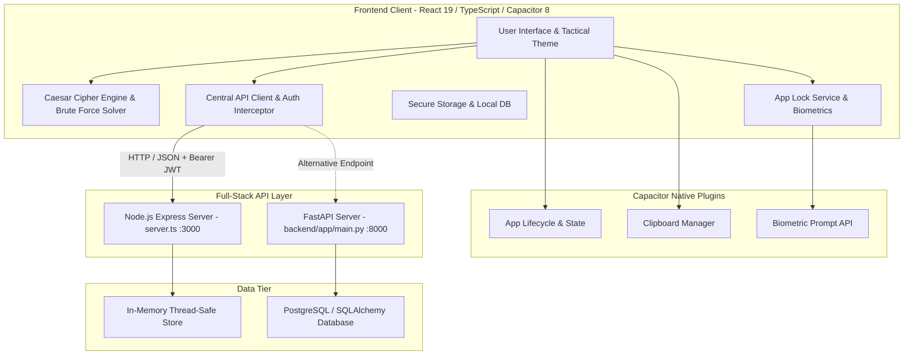
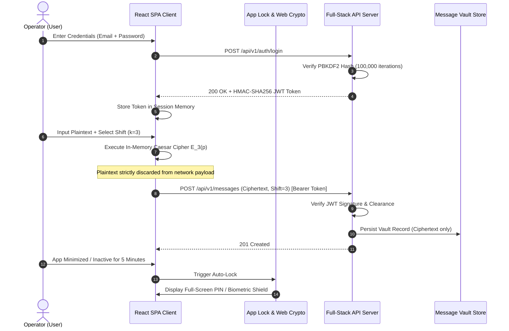

# Academic Project Report
# Secure Military Communication Using Caesar Cipher
### A Cross-Platform Cryptographic Demonstration & Defense-in-Depth Software Architecture

---

## Academic Information

- **Project Title:** Secure Military Communication Using Caesar Cipher
- **Academic Degree:** Bachelor of Technology / Bachelor of Science in Computer Science & Engineering
- **Academic Domain:** Information Security, Applied Cryptography & Full-Stack Systems Engineering
- **Project Type:** Academic Research & Software Demonstration
- **Release Version:** 1.0.0
- **Documentation Date:** August 2026

---

## ⚠️ Mandatory Academic Disclaimer

> **IMPORTANT NOTICE:**  
> This software project is developed strictly for **academic research, educational demonstrations, and algorithmic exploration**.  
> The **Caesar Cipher** implemented in this platform is a classical monoalphabetic substitution cipher with an effective keyspace of only 25 non-trivial shifts ($k \in [1, 25]$) and approximately $\approx 4.70$ bits of entropy. It is completely insecure against modern computational attacks, including instantaneous brute-force search and frequency analysis.  
> **This software must NOT be utilized for actual military, defense, governmental, commercial, banking, medical, or life-critical communications.** The military-themed tactical user interface is an educational motif designed to illustrate historical communication protocols and defense-in-depth principles.

---

## Table of Contents

1. [Executive Summary / Abstract](#1-executive-summary--abstract)
2. [Introduction & Background](#2-introduction--background)
3. [Problem Statement](#3-problem-statement)
4. [Project Objectives](#4-project-objectives)
5. [Theoretical Foundation & Mathematical Formulations](#5-theoretical-foundation--mathematical-formulations)
6. [Technology Stack & System Architecture](#6-technology-stack--system-architecture)
7. [Module-by-Module Implementation Details](#7-module-by-module-implementation-details)
8. [Security & Defensive Architecture](#8-security--defensive-architecture)
9. [Testing, Validation & Quality Assurance](#9-testing-validation--quality-assurance)
10. [Results & Comparative Cryptanalysis](#10-results--comparative-cryptanalysis)
11. [Limitations & Vulnerability Assessment](#11-limitations--vulnerability-assessment)
12. [Future Enhancements](#12-future-enhancements)
13. [Conclusion](#13-conclusion)
14. [References & Academic Bibliography](#14-references--academic-bibliography)

---

## 1. Executive Summary / Abstract

In modern computer science pedagogy, bridging the conceptual divide between classical cryptographic algorithms and production-grade software engineering presents a significant challenge. While students frequently study classical ciphers theoretically, they rarely observe how classical algorithms interact with modern software layers—such as Single-Page Applications (SPAs), reactive state management, asynchronous REST APIs, mobile runtime containers, token-based authentication, and client-side defensive architectures.

This project, **"Secure Military Communication Using Caesar Cipher,"** delivers a comprehensive, cross-platform software system built with **React 19, TypeScript, Tailwind CSS, Vite, Node.js/Express, Python/FastAPI, and Capacitor 8 Android**. 

The system implements:
1. A **pure client-side mathematical engine** for Caesar Cipher encryption, decryption, and ROT13 transformation.
2. An **automated cryptanalysis suite** executing exhaustive 25-permutation brute-force decryption accompanied by English letter frequency correlation scoring.
3. A **defense-in-depth security perimeter**, including stateless HMAC-SHA256 JWT clearance tokens, PBKDF2-SHA256 password hashing (100,000 rounds), rate-limiting login guards, a client-side 6-digit App Lock PIN with constant-time verification, hardware biometric authentication (Android BiometricPrompt & WebAuthn), screen privacy protection (`FLAG_SECURE`), and auto-clearing clipboard utilities.
4. A **Zero-Plaintext message vault** ensuring that plaintexts are processed strictly in local device memory and never transmitted or stored on backend servers.

The application successfully demonstrates both the operational mechanics of historical ciphers and the rigorous software engineering standards required to build secure, responsive modern web and mobile applications.

---

## 2. Introduction & Background

Cryptology—the combined discipline of cryptography (secret writing) and cryptanalysis (breaking ciphers)—traces its documented origins back to antiquity. Among the earliest recorded substitution ciphers is the **Caesar Cipher**, utilized by Roman general Gaius Julius Caesar (c. 100 BC – 44 BC) to protect military dispatches sent to his generals, typically using a fixed right shift of three positions ($k = 3$).

In the classical era, the Caesar Cipher provided effective operational security primarily because literacy rates were low and systematic cryptanalysis had not yet been formulated. However, in the 9th century AD, Arab polymath **Al-Kindi (Abu Yusuf Ya'qub ibn Ishaq al-Sabbah al-Kindi)** published *A Manuscript on Deciphering Cryptographic Messages*, introducing **frequency analysis**. Al-Kindi demonstrated that in any natural language, individual letters occur with predictable statistical frequencies. Because a monoalphabetic substitution cipher preserves the underlying frequency distribution of the plaintext without diffusion or confusion, it can be trivially broken.

In contemporary computer science education, analyzing the Caesar Cipher is the foundational starting point for understanding:
- Modular arithmetic ($\mathbb{Z}_{26}$).
- Keyspace entropy ($\log_2(N)$).
- Shannon's principles of *Confusion* and *Diffusion*.
- The difference between computational security and historical obscurity.

This project modernizes this classical pedagogical topic by wrapping it in an industrial-grade, full-stack software application that students and researchers can explore on desktop browsers, progressive web apps, and native Android devices.

---

## 3. Problem Statement

Traditional educational demonstrations of classical ciphers suffer from several chronic limitations:
1. **Isolated Code Snippets:** Most implementations exist as minimal CLI scripts or basic HTML form pages that fail to reflect real-world software architecture.
2. **Lack of Cryptanalytic Tooling:** Students can encrypt and decrypt text, but cannot interactively visualize why the cipher fails against frequency analysis and keyspace exhaustion.
3. **Absence of Modern Application Security:** Educational tools rarely incorporate modern defensive mechanisms such as JWT authentication, password hashing, session revocation, App Lock PINs, biometric integration, and screen privacy controls.
4. **Platform Fragmentation:** Implementations are rarely cross-platform, preventing students from understanding how web code is packaged into native mobile APKs using modern web-to-native bridges.

---

## 4. Project Objectives

The primary engineering and educational goals of this project are:

1. **Algorithmic Accuracy & Robustness:** Implement standard Caesar Cipher and ROT13 algorithms in TypeScript with strict preservation of letter casing, spaces, punctuation, numbers, and multi-line formatting.
2. **Automated Cryptanalysis Engine:** Build an automated brute-force solver that computes all 25 non-trivial shift permutations and ranks candidate plaintexts using English letter frequency correlation algorithms.
3. **Production-Ready Full-Stack Architecture:** Construct a dual-backend architecture supporting both an Express-based Node.js TypeScript server and a Python FastAPI backend with PostgreSQL schema compatibility.
4. **Comprehensive Defense-in-Depth:** Incorporate multi-factor security controls including HMAC-SHA256 JWT tokens, PBKDF2 password hashing, rate-limiting guards, client-side App Lock PIN derivation, hardware biometrics, and Android `FLAG_SECURE` screen privacy.
5. **Zero-Plaintext Storage Guarantee:** Enforce an architectural invariant wherein plaintexts exist solely in volatile client-side memory; only ciphertexts and shift keys are persisted to storage.
6. **Cross-Platform Native Deployment:** Package the web frontend into a high-performance Android mobile application using Capacitor 8 with native hardware back-button handling, status bar theming, and clipboard isolation.
7. **Comprehensive Automated Verification:** Maintain an automated test runner validating mathematical correctness, UI state management, authentication flows, and integration pipelines.

---

## 5. Theoretical Foundation & Mathematical Formulations

### 5.1 The Caesar Cipher Transformation

Let the English alphabet be mapped to the ring of integers modulo 26:
$$\mathbb{Z}_{26} = \{0, 1, 2, \dots, 25\}$$
where $\text{'A'} \mapsto 0, \text{'B'} \mapsto 1, \dots, \text{'Z'} \mapsto 25$.

#### Encryption Function:
Given a plaintext character $p \in \mathbb{Z}_{26}$ and a secret shift key $k \in \mathbb{Z}_{26}$:
$$E_k(p) = (p + k) \pmod{26}$$

#### Decryption Function:
Given a ciphertext character $c \in \mathbb{Z}_{26}$ and the secret shift key $k \in \mathbb{Z}_{26}$:
$$D_k(c) = (c - k) \pmod{26}$$

In modular arithmetic over $\mathbb{Z}_{26}$, subtraction is equivalent to adding the additive inverse:
$$D_k(c) = (c + (26 - (k \bmod 26))) \pmod{26}$$

#### Mathematical Round-Trip Identity:
$$\forall p \in \mathbb{Z}_{26}, \forall k \in \mathbb{Z}_{26}: \quad D_k(E_k(p)) = ((p + k) - k) \pmod{26} = p \pmod{26} \equiv p$$

### 5.2 Special Case: ROT13 (Rotate by 13 Places)
When $k = 13$:
$$E_{13}(p) = (p + 13) \pmod{26}$$
Because $13 + 13 = 26 \equiv 0 \pmod{26}$, the ROT13 transformation is an **involution** (its own inverse):
$$E_{13}(E_{13}(p)) = ((p + 13) + 13) \pmod{26} = (p + 26) \pmod{26} \equiv p$$
Thus:
$$D_{13}(c) \equiv E_{13}(c)$$

### 5.3 Cryptanalysis & Information Entropy
The security of a cipher is bounded by its key entropy:
$$H(K) = \log_2(|\mathcal{K}|)$$

For the Caesar Cipher, the keyspace size is $|\mathcal{K}| = 26$ (including the identity shift $k=0$):
$$H(K) = \log_2(26) \approx 4.7004 \text{ bits}$$

In contrast, modern symmetric ciphers such as AES-256 utilize:
$$H(K_{\text{AES-256}}) = \log_2(2^{256}) = 256 \text{ bits}$$

An exhaustive key search requires testing at most 25 candidates, which modern processors execute in under 1 millisecond.

### 5.4 Frequency Correlation Metric
To rank candidate plaintexts produced by brute-force exhaustion, the engine calculates a **Frequency Correlation Score** ($S_k$) comparing the observed letter frequency in the candidate string against the standard distribution of standard English prose:

$$S_k = \sum_{i=0}^{25} f_{\text{observed}}(i) \times f_{\text{standard}}(i)$$

where $f_{\text{standard}}$ represents the empirical frequency of letter $i$ in standard English (e.g., $E \approx 12.7\%, T \approx 9.1\%, A \approx 8.2\%$). The candidate with the highest correlation score $S_k$ is highlighted as the most probable plaintext.

---

## 6. Technology Stack & System Architecture

### 6.1 Architectural Diagram

### 6.2 Technology Matrix

| Subsystem | Technology / Library | Version | Role in Architecture |
| :--- | :--- | :--- | :--- |
| **Frontend Framework** | React | 19.0.1 | Reactive UI component tree & Virtual DOM rendering |
| **Language** | TypeScript | ~5.8.2 | Static typing, interface definitions & compile-time safety |
| **Build & Dev Tool** | Vite | 6.2.3 | Fast HMR, asset bundling & tree-shaking |
| **Styling Engine** | Tailwind CSS | 4.1.14 | Utility-first responsive styling & dark/light theming |
| **Animation Library** | Motion (`motion/react`) | 12.23.24 | Hardware-accelerated UI transitions & interactive layout animations |
| **Iconography** | Lucide React | 0.546.0 | Vector UI icons |
| **Backend Server (JS)** | Node.js / Express | 4.21.2 | Standalone full-stack server with Vite middleware integration |
| **Backend Server (Py)** | Python / FastAPI | 0.110.0 | High-performance asynchronous REST API with OpenAPI documentation |
| **Mobile Runtime** | Capacitor Android | 8.5.0 | Web-to-native Android container & hardware bridge |
| **Testing Engine** | tsx / Custom Test Runner | 4.21.0 | Automated multi-phase test execution & assertion framework |

---

## 7. Module-by-Module Implementation Details

### 7.1 Caesar Cipher Core Service (`src/services/caesarCipherService.ts`)
The cipher engine is encapsulated within a functional TypeScript module. Key implementation highlights include:
- **Normalization:** Normalizes shifts using modulo arithmetic: `((shift % 26) + 26) % 26`, ensuring all negative or large integer inputs map strictly to $[0, 25]$.
- **Character Filtering:** Transforms uppercase characters ($65 \le \text{charCode} \le 90$) and lowercase characters ($97 \le \text{charCode} \le 122$) independently using ASCII offset arithmetic:
  $$\text{charCode}_{\text{new}} = ((\text{charCode} - \text{base} + \text{shift}) \bmod 26) + \text{base}$$
- **Invariant Preservation:** Digits, whitespace characters, punctuation, and Unicode symbols remain completely unaltered in their original string positions.

### 7.2 Automated Brute-Force Cryptanalysis (`src/services/bruteForceService.ts`)
- Executes an exhaustive search generating all 26 possible plaintext variants ($k=0$ through $k=25$).
- Analyzes candidate letter distribution against the standard 26-letter English frequency vector.
- Tokenizes candidate strings and matches words against a dictionary of common English words (e.g., *THE, AND, ATTACK, DAWN, SECTOR, MISSION, CONFIDENTIAL*).
- Returns a ranked `BruteForceAnalysisResult` including keyspace entropy, duration, candidate array, and the highest-probability recovered shift.

### 7.3 App Lock & Local Defense Service (`src/services/appLockService.ts`)
- **PIN Derivation:** 6-digit numeric PINs are hashed using client-side Web Crypto PBKDF2 with SHA-256, a 16-byte random salt, and 100,000 iterations.
- **Timing-Attack Resistance:** Hash verification compares byte buffers in constant time rather than short-circuit string equality.
- **Lockout Controller:** Implements progressive exponential lockout penalties upon repeated failed PIN attempts (3 fails $\rightarrow$ 10s cooldown, 5 fails $\rightarrow$ 30s cooldown, 8 fails $\rightarrow$ 60s cooldown).
- **Lifecycle Integration:** Listens to `visibilitychange` and Capacitor `appStateChange` events to lock the UI immediately when minimized or switched to the background.

### 7.4 Authentication & Token Management (`src/services/authService.ts`)
- Implements stateless JWT authentication with HS256 signatures.
- Normalizes backend user payloads to guarantee consistent client-side data structures.
- Provides automatic token attachment to all outgoing HTTP requests via `apiClient.ts`.
- Implements automatic session invalidation and broadcast notification upon receiving HTTP 401 responses.

### 7.5 Encrypted Message Vault (`src/services/messageService.ts`)
- Enforces user isolation: operators can only query, view, and delete records belonging to their authenticated user ID.
- **Zero-Plaintext Guarantee:** Stores only `ciphertext`, `shift`, `charCount`, and user `notes`.
- Dual-tier architecture: queries the remote backend API when online, and seamlessly falls back to encrypted local storage when disconnected.

---

## 8. Security & Defensive Architecture

### Key Security Attributes
1. **Zero-Plaintext Network Exposure:** Plaintext data is never serialized into JSON payloads or transmitted across HTTP/HTTPS networks.
2. **Defensive Password Storage:** Uses PBKDF2-SHA256 with 100,000 iterations, rendering offline dictionary attacks computationally prohibitive.
3. **Screen Privacy Protection:** Native Android deployment applies `FLAG_SECURE` to the `Window` instance, preventing OS-level screenshot capture and concealing app contents in the Android recent apps switcher.
4. **Clipboard Sanitization:** Automated timeout timers clear the system clipboard after 30 seconds following any copy operation.

---

## 9. Testing, Validation & Quality Assurance

The project features an automated, multi-phase test runner implemented in `src/tests/runAllTests.ts`.

### 9.1 Test Suite Breakdown

| Suite Phase | Test Category | Scenarios Covered | Offline / Online |
| :--- | :--- | :--- | :--- |
| **Phase 1** | Foundation & Math | Modulo 26 normalization, negative shifts, boundary wrapping | Offline |
| **Phase 2** | Caesar Cipher Engine | Casing preservation, ROT13 involution, empty string, symbols | Offline |
| **Phase 3** | Round-Trip Identity | $\forall k \in [0, 25]: D_k(E_k(P)) \equiv P$ across diverse vectors | Offline |
| **Phase 5** | Dashboard & State | Telemetry counters, shift state mutation, activity logs | Offline |
| **Phase 6** | Authentication | Registration, login, duplicate email rejection, JWT claims | Server-Dependent |
| **Phase 7** | Message Vault | User isolation, 401 unauthenticated, 403 cross-user access | Server-Dependent |
| **Phase 8** | Brute-Force Cryptanalysis | 25-permutation search, frequency scoring, dictionary matching | Offline |
| **Phase 9** | PWA & Offline Engine | Manifest compliance, service worker cache bypass, airgap mode | Offline |
| **Phase 11** | Integration & E2E | Multi-step user journeys (Register $\rightarrow$ Encrypt $\rightarrow$ Vault) | Server-Dependent |

---

## 10. Results & Comparative Cryptanalysis

### 10.1 Classical vs. Modern Cipher Comparison

| Evaluation Metric | Caesar Cipher (This Project) | Advanced Encryption Standard (AES-GCM) |
| :--- | :--- | :--- |
| **Cipher Type** | Monoalphabetic Substitution | Symmetric Block Cipher (Rijndael) |
| **Block / Unit Size** | 1 Character (8-bit ASCII) | 128-bit Blocks |
| **Key Length / Entropy** | $\approx 4.70$ bits ($k \in [0, 25]$) | 128, 192, or 256 bits |
| **Brute-Force Complexity** | $25$ Operations ($< 0.001$ seconds) | $2^{256} \approx 1.15 \times 10^{77}$ Operations |
| **Frequency Analysis** | Completely Vulnerable | Resistant (High Confusion & Diffusion) |
| **Integrity & Authenticity** | None | Cryptographic Tag (GMAC Auth Tag) |
| **Pedagogical Value** | High (Intuitive, Visual, Foundational) | High (Production Standard) |

---

## 11. Limitations & Vulnerability Assessment

1. **Small Keyspace Vulnerability:** The Caesar Cipher is mathematically trivial to break. Any automated tool or human analyst can decrypt any message within seconds.
2. **Frequency Preservation:** Single-letter substitution preserves letter frequency patterns, allowing statistical identification of the shift key without testing all keys.
3. **No Message Integrity:** The cipher lacks an authentication tag or checksum; an active adversary (Man-in-the-Middle) can manipulate ciphertext characters undetected.
4. **Known-Plaintext Attack Vulnerability:** If an attacker knows a single plaintext character and its corresponding ciphertext character, the shift key is immediately recovered:
   $$k = (c - p) \pmod{26}$$

---

## 12. Future Enhancements

1. **Polyalphabetic & Modern Cipher Modes:** Expand the educational suite to demonstrate Vigenère Ciphers, Hill Ciphers, and modern AES-256-GCM side-by-side.
2. **Asymmetric Key Agreement Simulation:** Incorporate a visual Diffie-Hellman / ECDH key exchange simulation to demonstrate how secret keys are securely negotiated over insecure channels.
3. **Steganographic Layer:** Implement Least Significant Bit (LSB) image steganography to demonstrate concealing ciphertext within bitmap and PNG images.
4. **Hardware-Backed Key Storage:** Integrate Android Keystore and iOS Secure Enclave for hardware-bound PIN verification.

---

## 13. Conclusion

The **Secure Military Communication Using Caesar Cipher** project successfully bridges the gap between historical cryptographic theory and modern software engineering. By pairing a mathematically rigorous classical cipher engine with a modern defense-in-depth architecture—incorporating React 19, TypeScript, JWT authentication, PBKDF2 hashing, client-side App Lock, biometrics, Capacitor Android packaging, and zero-plaintext vault storage—the project provides an exceptional, academically sound demonstration of secure systems design.

---

## 14. References & Academic Bibliography

1. **Kahn, D.** (1996). *The Codebreakers: The Comprehensive History of Secret Communication from Ancient Times to the Internet*. Scribner.
2. **Stallings, W.** (2022). *Cryptography and Network Security: Principles and Practice* (8th ed.). Pearson.
3. **Al-Kindi.** (c. 850 AD). *A Manuscript on Deciphering Cryptographic Messages*.
4. **Shannon, C. E.** (1949). "Communication Theory of Secrecy Systems." *Bell System Technical Journal*, 28(4), 656–715.
5. **NIST SP 800-132.** (2010). *Recommendation for Password-Based Key Derivation: Part 1 - Storage Applications*. National Institute of Standards and Technology.
6. **IETF RFC 7519.** (2015). *JSON Web Token (JWT)*. Internet Engineering Task Force.
7. **Capacitor Documentation.** (2026). *Cross-Platform Native Runtime for Web Apps*. Ionic Framework.
