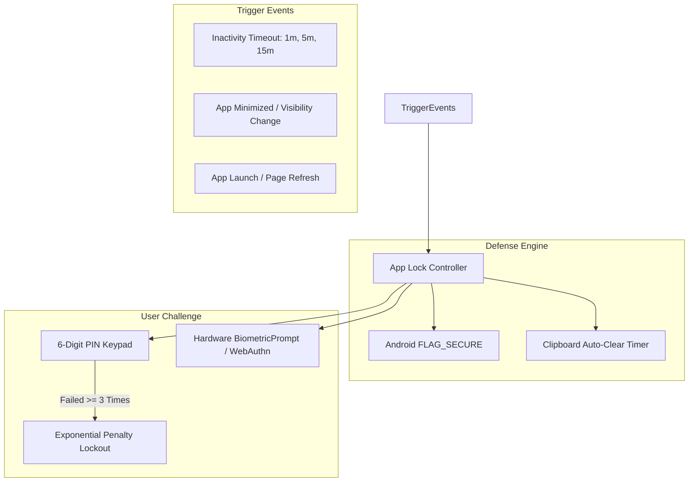

# Security Architecture & Threat Model
# Secure Military Communication Platform

---

## 1. Executive Security Summary & Disclaimer

> **CRITICAL ACADEMIC NOTICE:**  
> The **Caesar Cipher** algorithm demonstrated in this application provides **zero cryptographic confidentiality** against modern computational attacks. It is implemented purely for academic demonstration and education.  
> However, the surrounding **software architecture** implements modern, industry-standard application security controls, including PBKDF2 password hashing, HMAC-SHA256 JWT tokens, constant-time PIN verification, rate limiting, and hardware biometric integrations.

---

## 2. Threat Modeling: STRIDE Analysis

| Threat Category | Potential Attack Vector | Architectural Mitigation Implemented |
| :--- | :--- | :--- |
| **S - Spoofing** | Adversary pretends to be a legitimate tactical operator. | Stateless HMAC-SHA256 JWT authentication; PBKDF2-SHA256 password verification with 100,000 iterations; Google OAuth 2.0 gateway; WebAuthn passkeys. |
| **T - Tampering** | Adversary alters ciphertext records in transit or storage. | Zero-Plaintext architecture; user-isolated backend mutation routes; HMAC token signatures prevent tampering with user claims. |
| **R - Repudiation** | Operator denies transmitting or vaulting a sensitive dispatch. | Vault records store exact timestamps, user ownership IDs, and operation types (`ENCRYPT` / `DECRYPT`). |
| **I - Information Disclosure** | Interception of sensitive communications over the network. | Plaintext is never transmitted or stored on backend servers; HTTPS/TLS transport encryption; Android `FLAG_SECURE` screen privacy; auto-clearing clipboard. |
| **D - Denial of Service** | Automated brute-force attacks against the login API. | IP and username rate-limiting buckets; temporary 60-second account lockouts after 5 failed authentication attempts. |
| **E - Elevation of Privilege** | Confidential-tier user accessing Top Secret vault messages. | Role-Based Clearance validation (`CONFIDENTIAL`, `SECRET`, `TOP_SECRET`) enforced on both client routing and server endpoint handlers. |

---

## 3. Cryptographic Implementation Details

### 3.1 Server-Side Password Hashing
Password hashes are generated using the standard **Password-Based Key Derivation Function 2 (PBKDF2)** specified in NIST SP 800-132:
- **Hash Algorithm:** HMAC-SHA256
- **Iteration Count:** $100,000$ rounds
- **Salt:** 16-byte cryptographically secure random value generated via `crypto.randomBytes(16)`
- **Output Length:** 32 bytes (256 bits) represented as a 64-character hexadecimal string
- **Verification:** Evaluated using constant-time comparison `crypto.timingSafeEqual` to prevent side-channel timing attacks.

### 3.2 Client-Side App Lock PIN Derivation
Local device PINs are protected entirely on the client without transmitting the PIN to any server:
```typescript
// Web Crypto PBKDF2 derivation
const keyMaterial = await window.crypto.subtle.importKey(
  'raw',
  new TextEncoder().encode(pin),
  { name: 'PBKDF2' },
  false,
  ['deriveBits']
);

const derivedBits = await window.crypto.subtle.deriveBits(
  {
    name: 'PBKDF2',
    salt: saltBytes,
    iterations: 100000,
    hash: 'SHA-256',
  },
  keyMaterial,
  256
);
```

### 3.3 Constant-Time Hash Comparison
To prevent attackers from deducing the correct PIN digit-by-digit using microsecond timing measurements:
```typescript
function constantTimeCompare(a: Uint8Array, b: Uint8Array): boolean {
  if (a.length !== b.length) return false;
  let result = 0;
  for (let i = 0; i < a.length; i++) {
    result |= a[i] ^ b[i];
  }
  return result === 0;
}
```

---

## 4. Client-Side Defensive Controls



1. **Inactivity Auto-Lock:** Tracks keyboard, mouse, and touch events; automatically engages the lock screen when the operator is idle.
2. **App Minimize Detection:** Listens to `document.visibilitychange` and Capacitor `appStateChange` to immediately shield the viewport when the app loses focus.
3. **Android `FLAG_SECURE`:** Prevents OS-level screen recording, third-party screenshot capturing, and hides sensitive payloads in the Android multi-tasking preview.
4. **Clipboard Sanitization:** Wipes copied text from the system clipboard after 30 seconds to minimize data exposure.
