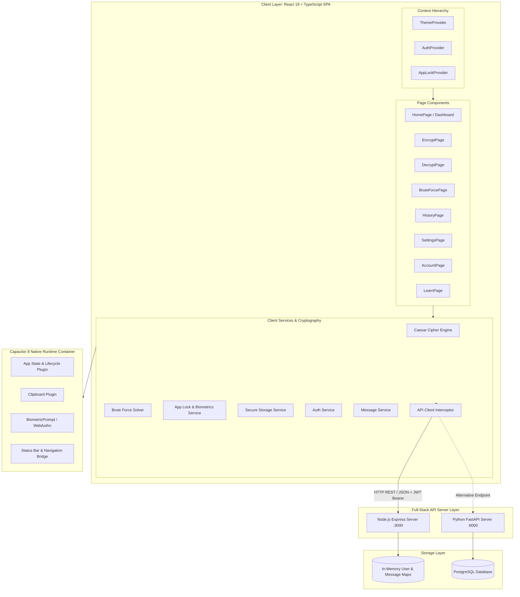
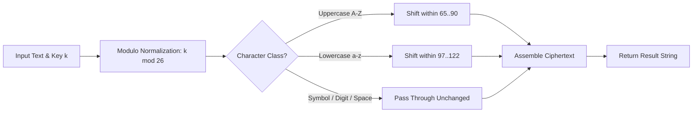
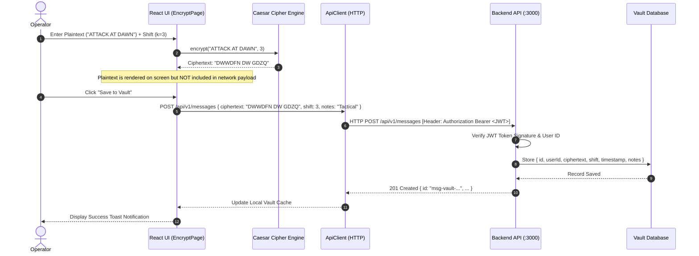

# System Architecture Documentation
# Secure Military Communication Platform

---

## 1. Architectural Overview

The **Secure Military Communication** platform employs a decoupled, layered client-server architecture designed for cross-platform execution on Modern Web Browsers, Progressive Web App (PWA) runtimes, and Native Android devices via Capacitor 8.



---

## 2. Frontend Layer Architecture

### 2.1 React 19 Component Hierarchy
The UI entry point (`src/App.tsx`) orchestrates three top-level Context Providers in a strict nesting hierarchy:

```tsx
<ThemeProvider>
  <AuthProvider>
    <AppLockProvider>
      <AppLockScreen />   {/* Full-screen security barrier */}
      <AppContent />      {/* Primary tactical navigation and views */}
    </AppLockProvider>
  </AuthProvider>
</ThemeProvider>
```

1. **ThemeProvider (`src/context/ThemeContext.tsx`):**
   - Manages `dark`, `light`, and `system` modes.
   - Synchronizes with `document.documentElement` class list and `localStorage`.
   - Binds to native Android status bar styling via Capacitor.
2. **AuthProvider (`src/context/AuthContext.tsx`):**
   - Holds the authenticated `User` object and active JWT access token.
   - Subscribes to `authService` lifecycle events and manages token expiration timers.
   - Provides login, registration, Google OAuth, and logout dispatcher methods.
3. **AppLockProvider (`src/context/AppLockContext.tsx`):**
   - Manages client-side lock state (`isLocked`), PIN verification status, and biometric prompt triggers.
   - Listens to user activity timers and triggers auto-lock on inactivity or app minimize.

### 2.2 Navigation Architecture
The application uses a state-driven view router (`AppView` type in `src/types/navigation.ts`) supporting instantaneous view switching without page reloads:
- `home` / `dashboard`: Operations hub, quick actions, and telemetry metrics.
- `encrypt`: Ciphertext generation studio with interactive rotary dials and sliders.
- `decrypt`: Plaintext recovery studio with reverse shift calculators.
- `bruteforce`: Exhaustive 25-shift cryptanalysis engine with frequency scoring.
- `history`: User-isolated encrypted message vault with search and multi-criteria sorting.
- `learn`: Academy curriculum covering Caesar cipher history, mathematical formulas, and cryptanalysis.
- `settings`: System preferences, App Lock configuration, theme selection, and clipboard security.
- `account`: Operator profile, clearance level badges, and security posture health indicators.
- `login` / `register`: Secure operator authentication and onboarding screens.

---

## 3. Cryptography & Service Architecture

### 3.1 Caesar Cipher Service (`src/services/caesarCipherService.ts`)
The cipher engine is fully decoupled from the UI:



### 3.2 Automated Brute Force Cryptanalysis (`src/services/bruteForceService.ts`)
1. Generates 25 candidate permutations for $k \in [1, 25]$.
2. Computes the **Frequency Correlation Score**:
   $$S_k = \sum_{i=0}^{25} f_{\text{observed}}(i) \times f_{\text{standard}}(i)$$
3. Performs dictionary token lookup against known English military/general terms.
4. Identifies the optimal candidate and computes keyspace metrics.

### 3.3 App Lock & Web Crypto Service (`src/services/appLockService.ts`)
- **Key Derivation:** Employs Web Crypto API (`window.crypto.subtle.deriveBits`) using PBKDF2 with SHA-256, a 16-byte random salt, and 100,000 iterations.
- **Constant-Time Verification:** Compares the derived hash byte-by-byte using bitwise XOR accumulation to eliminate side-channel timing leaks.

---

## 4. Backend Layer Architecture

The platform supports two fully compatible backend implementations:

### 4.1 Node.js / Express Architecture (`server.ts`)
- **Runtime:** Node.js v18+ running TypeScript via `tsx` or bundled via `esbuild` to `dist/server.cjs`.
- **Integrated Vite Middleware:** Mounts Vite development server middlewares in development mode; serves pre-compiled static assets and SPA catch-all routes in production mode.
- **In-Memory Store:** Employs thread-safe JavaScript `Map` structures for `usersDb` and `messagesDb`.
- **Stateless JWT Tokens:** Issues HS256-signed JWTs containing `sub`, `email`, `username`, and `clearance` claims with 2-hour expiration.

### 4.2 Python / FastAPI Architecture (`backend/app/main.py`)
- **Runtime:** Python 3.10+ with FastAPI, Pydantic v2, and Uvicorn/Gunicorn.
- **Repository Pattern:** Decouples API route handlers from database access via `UserRepository` and `MessageRepository`.
- **Database Support:** Seamlessly toggles between thread-safe in-memory stores and PostgreSQL via SQLAlchemy.
- **Security Middleware:** Enforces CORS policies, secure HTTP headers, and structured JSON error responses.

---

## 5. Native Mobile Architecture (Capacitor 8)

The mobile application is packaged as a native Android APK using Capacitor 8.

```mermaid
graph TD
    subgraph Web App Assets
        HTML[index.html]
        JS[Bundled JS / Vite Assets]
        CSS[Tailwind CSS]
    end

    subgraph Capacitor Web View
        Bridge[Capacitor JavaScript Bridge]
    end

    subgraph Native Android Runtime
        Activity[MainActivity.java]
        Plugins[Native Capacitor Plugins]
        BioPrompt[Android BiometricPrompt API]
        KeyStore[Android KeyStore / OS Security]
        WindowMgr[Window FLAG_SECURE]
    end

    Web App Assets --> Capacitor Web View
    Bridge <--> Plugins
    Plugins --> Activity
    Plugins --> BioPrompt
    Plugins --> KeyStore
    Activity --> WindowMgr
```

### Native Capabilities Implemented:
1. **Hardware Back Button Handling:** Custom routing hook intercepts Android back button events to navigate back within the app view history rather than exiting the application.
2. **App Lifecycle Monitoring:** Listens to `appStateChange` to immediately engage the App Lock screen whenever the user switches apps or enters the home screen.
3. **Screen Privacy (`FLAG_SECURE`):** Configures Android window flags to prevent OS screenshots and obscure the app's contents in the recent apps task switcher.
4. **Biometric Integration:** Connects client-side authentication to Android's native `BiometricPrompt` framework for fingerprint and face unlock.

---

## 6. End-to-End Data Flow

### 6.1 Zero-Plaintext Encryption & Vault Persistence Flow



---

## 7. Security Architecture & Threat Model

| Threat / Attack Vector | Mitigation Strategy Implemented |
| :--- | :--- |
| **Network Eavesdropping / Sniffing** | Zero-Plaintext Architecture (plaintexts never traverse the network) + HTTPS / TLS transport. |
| **Credential Database Leak** | Passwords hashed using PBKDF2-SHA256 with 100,000 iterations and distinct 16-byte random salts. |
| **Brute-Force Login Attacks** | Exponential rate limiting and temporary IP/username lockout after 5 consecutive failed attempts. |
| **Physical Device Theft / Snooping** | Client-side App Lock PIN with PBKDF2 derivation, biometrics, and auto-lock inactivity timers. |
| **Screen Capture & App Switcher Leaks** | Android `FLAG_SECURE` window setting prevents OS screenshots and task switcher previews. |
| **Clipboard Data Retention** | Auto-clearing clipboard timers wipe copied ciphertexts after 30 seconds. |
| **Timing Attacks on PIN Verification** | Constant-time byte-by-byte buffer comparison eliminates side-channel timing leaks. |
